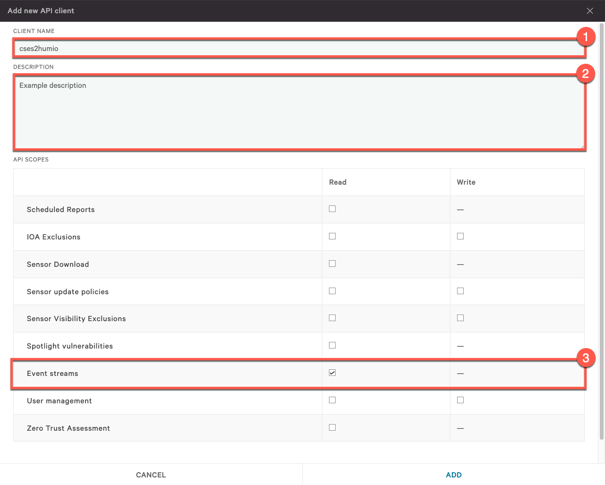
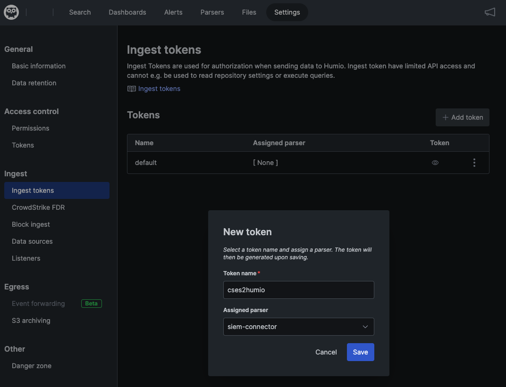

[](https://github.com/Trifork-Security/cses2humio/actions/workflows/CI.yml)

# CrowdStrike Falcon Event Stream to Humio

This project intend to provide a simple way of moving your CrowdStrike Falcon Event Stream data into Humio.  
As is the only reliable way of getting Event Stream data is with CrowdStrike's SIEM connector, that dumps to multiple files.  
We're trying to bypass the file stage and ship this directly to Humio and streamline ingest, providing CrowdStrike customers  
with Humio a simple way to maintain, visualize and alert on Falcon Event Stream data.

<br />

## Design

This project is build as a Python package (application) to be shipped within a Docker or other containerized environment.
The application error handling could be better, and the primary way to respond to unexpected errors is to shut down, relying on docker to restart the process.

<br />

## Changelog

### v0.0.4
- Additional improvement upon stability
- Migrated the enriched parser to Humio Package [Event Stream Utilities (es-utils)](https://github.com/Trifork-Security/es-utils)
- Added the metadata parameter, sending `@stream` and `@host` in Humio events

### v0.0.3
- Improved stability of threads
- Improved error handling, restarting threads when they die
- Implemented workaround for app id that doesn't return anything after stream dies

### v0.0.2

- Fixed refresh of streams that didn't happen in a timely manner
- Fixed arguments where specifying integer arguments would be parsed as strings
- Improved debug and info logging for better troubleshooting

### v0.0.1

- Initial release (fails to refresh stream after 30 minutes, please don't use this)

<br />

## Prerequisite

For setting up the connection you need two types of credentials ready.

- [Falcon API key-pair with read permissions to Event Streams](#obtaining-falcon-api-key-pair)
- [Humio ingest token to the repository receiving the data](#obtaining-humio-ingest-token)

For running the code one of the following is needed.

- Docker with access to persistent volume
- Python3 (with virtual environment recommended!)

<br />

### Obtaining Falcon API key-pair

* Login to your Falcon Console
* Go to Menu -> Support -> API Clients and Keys
* Click `Add new API client`
    * Set the client a name
    * Optional: fill the description
    * Assign `Event streams/read` access



<br />

### Obtaining Humio Ingest Token

* Login to your Humio cluster
* Go to the repository you're going to use
* Depending on if you're going to run enriched or not.

    * Enriched: Download the [siem-connector-enriched.yaml](siem-connector-enriched.yaml) parser or install the [es-utils package](https://github.com/Trifork-Security/es-utils)

        * Go to `Parsers` and click `New Parser` then select `From template` 

        * Give the parser a name, note, this is going to be assigned the `#type` field. E.g. `siem-connector-enriched`

        * Upload the yaml specification. This is for now an empty parser, you can simply create an empty parser yourself as well.

    * Normal: Install the package `crowdstrike/siem-connector` by doing the following<br />Note that enriched event can use thhis content as well

        * Go to `Settings` -> `Marketplace` -> `crowdstrike/siem-connector` and click `Install package` -> `Install`

* Go to `Settings` -> `Ingest tokens` and click `Add token`

    * Give the ingest token a good name

    * Enriched: assign the parser you created in previous step

    * Normal: select the `crowdstrike/siem-connector` -> `siem-connector`



<br />

## Installation

We recommend using the docker image unless you plan around creating this as a systemd service or similar.

```shell
# Clone the sample environment file
wget https://raw.githubusercontent.com/Trifork-Security/cses2humio/master/cses2humio.env.example -O cses2humio.env
```

Modify the attributes accordingly, for more information see [Command line and arguments](#command-line-and-arguments)

Start the container with the newly configured environment file

```shell
docker run -v $HOST_DATA_DIR:/data  \
    -e HOST=$HOSTNAME
    --name=cses2humio \
    --env-file=$PATH_TO_CONFIG_FILE \
    --detach --restart=always \
    ghcr.io/trifork-security/cses2humio:latest
```

See your data coming in!

```shell
docker logs -f cses2humio
```

<br />

## Command line and arguments

You can specify run arguments as command lines or environment variables (same as command line, just all uppercase)

| Argument&nbsp       | Environment       | Description                                                                                                                                                                           |
|---------------------|-------------------|---------------------------------------------------------------------------------------------------------------------------------------------------------------------------------------|
| --offset-file       | OFFSET_FILE       | General: Where to save offsets for partitions. File will be created automatically<br />Default: `offset.db`<br />Note that the `cses2humio.env.example` defaults to `/data/offset.db` |
| --enrich            | ENRICH            | General: Parses the events before shipping to Humio, and expands some fields due to such parsing in Humio can be tricky<br />Default: `False`                                         |
| --metadata          | METADATA          | General: Add @stream and @host to events in Humio, if the app is running in a container, set the `HOST` environment variable to what you want in `@host`<br />Default: `False`        |
| --verbose           | VERBOSE           | General: Be verbose, use for debugging and troubleshooting<br />Default: `False`                                                                                                      |
| --falcon-url        | FALCON_URL        | Falcon: Url to the API, __not__ the console<br />Default: `https://api.crowdstrike.com`                                                                                               |
| --falcon-api-id     | FALCON_API_ID     | Falcon: API ID for the created key<br />Default: `N/A`                                                                                                                                |
| --falcon-api-secret | FALCON_API_SECRET | Falcon: API Secret for the created key<br />Default: `N/A`                                                                                                                            |
| --humio-url         | HUMIO_URL         | Humio: Url for the Humio Cluster for events to go<br />Default: `https://cloud.humio.com`                                                                                             |
| --humio-token       | HUMIO_TOKEN       | Humio: Ingest token, remember to assign correct parser<br />Default: `N/A`                                                                                                            |
| --app-id            | APP_ID            | Advanced: Specific to Falcon Event Stream, don't change unless you know what you're doing!<br />Default: `cses2humio`                                                                 |
| --user-agent        | USER_AGENT        | Advanced: User agent used in HTTP requests<br />Default: `cses2humio/{version}`                                                                                                       |
| --bulk-max-size     | BULK_MAX_SIZE     | Advanced: Maximum number of events to send in bulk<br />Default: `200`                                                                                                                |
| --flush-wait-time   | FLUSH_WAIT_TIME   | Advanced: Maximum wait time before flushing queue<br />Default: `10`                                                                                                                  |
| --stream-timeout    | STREAM_TIMEOUT    | Advanced: Timeout for the event stream connection<br />Default: `60`                                                                                                                  |
| --retry-timer       | RETRY_TIMER       | Advanced: How long to wait before retrieving streams between failures <br />Default: `300`                                                                                            |
| --appid-random      | APPID_RANDOM      | Advanced: How many retries before going with random app id, zero is considered disabled<br />Default: `1`                                                                             |
| --keepalive         | KEEPALIVE         | Advanced: How often to verify threads are alive<br />Default: `10`                                                                                                                    |
| --exceptions        | EXCEPTIONS        | Advanced: Dump exceptions, used on top of verbose, will cause multiline logs<br />Default: `False`                                                                                    |

<br />

You can also run the tool directly from commandline (using environment variables as well)

```
cses2humio -h
usage: cses2humio [-h] [--offset-file OFFSET_FILE] [--enrich] [--metadata] [-v] [--falcon-url FALCON_URL] [--falcon-api-id FALCON_API_ID] [--falcon-api-secret FALCON_API_SECRET] [--humio-url HUMIO_URL] [--humio-token HUMIO_TOKEN] [--app-id APP_ID] [--user-agent USER_AGENT] [--bulk-max-size BULK_MAX_SIZE]
                  [--flush-wait-time FLUSH_WAIT_TIME] [--stream-timeout STREAM_TIMEOUT] [--retry-timer RETRY_TIMER] [--appid-random APPID_RANDOM] [--keepalive KEEPALIVE] [--exceptions]

CrowdStrike Falcon Event Stream to Humio

optional arguments:
  -h, --help            show this help message and exit

General:
  --offset-file OFFSET_FILE
                        Location including filename for where to store offsets, default is current directory as offset.db
  --enrich              Will parse some fields as they're hard to parse in Humio.Note this might be more resources intensive but spare Humio of parsing. Default is off
  --metadata            Will add metadata to event such as app id and host running the stream. Requires --enrich. Default is off
  -v, --verbose         Increase output verbosity

Falcon:
  --falcon-url FALCON_URL
                        Falcon API URL, note this is for the API given when you create the API key. Defaults to US-1 API url
  --falcon-api-id FALCON_API_ID
                        Falcon API ID to use for OAuth2
  --falcon-api-secret FALCON_API_SECRET
                        Falcon API Secret to use for OAuth2

Humio:
  --humio-url HUMIO_URL
                        Humio URL for the cluster going to ingest data. Default to https://cloud.humio.com
  --humio-token HUMIO_TOKEN
                        Ingest token to use for ingesting data. Remember to assign the correct parser depending on parsing

Advanced:
  --app-id APP_ID       App ID to use for consuming events
  --user-agent USER_AGENT
                        User agent used to connect to services
  --bulk-max-size BULK_MAX_SIZE
                        Maximum number of events to send in bulk
  --flush-wait-time FLUSH_WAIT_TIME
                        Maximum time to wait if bulk max size isn't reached
  --stream-timeout STREAM_TIMEOUT
                        Timeout for the event stream connection
  --retry-timer RETRY_TIMER
                        How long to wait before retrieving streams between failures
  --appid-random APPID_RANDOM
                        How many retries before going with random app id, 0 = disabled
  --keepalive KEEPALIVE
                        How often to verify threads are alive
  --exceptions          Dump exceptions, used on top of verbose, will cause multiline logs
```

<br />

## Building

```bash
# Clone the repo and switch to it
git clone https://github.com/Trifork-Security/cses2humio.git
cd cses2humio
```

```bash
# Create virtual environment and activate (optional, but recommended)
python3 -m venv venv
source venv/bin/activate
```

```bash
# Install build and build the package (used in Dockerfile)
pip3 install build
python3 -m build 
```

```bash
# Build the docker image
docker build -t [TAG_FOR_IMAGE] .
```

<br />

## Todo

 - [ ] Unit testing
 - [ ] Better error handling
 - [ ] Offset file based on Humio
 - [ ] Next-gen format for logs for better use

<br />

## Contributing

Please feel free to contribute at any time by doing a PR.

<br />

## License

[Apache License 2.0](/LICENSE)
